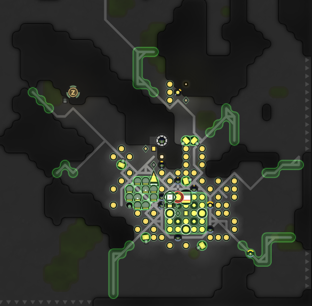
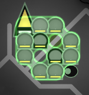
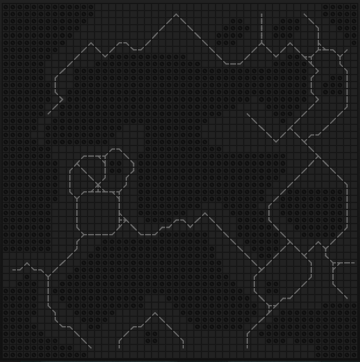

# Room Layout

----



As you can see in the above image, the clarkok bot is using a flexible room layout. In the layout procedure, the bot
will try every possible location for the spawn cluster, and for each attempt, place down the lab cluster, calculate the
roads to the sources / controller / mineral and the lab cluster, generate the extensions and towers in a dynamic manner,
and then use the min-cut algorithm to place the ramparts. And from all those attempts, we choose the solution with
minimum ramparts, and if multiple solutions use the same number of ramparts, we choose the one with smallest number of
roads from spawn cluster to sources and controllers. 

The planner is written in generators, and the execution is split into multiple ticks (often in hundreds or even
thousands of ticks), and executed by the room score federal level state machine ahead of room claiming, except for the
first room after a respawn. As for the first room, we skip the rampart generation as it is the most time-consuming part,
to save us precious start up ticks.

## Spawn Cluster


The spawn cluster contains all 3 spawns and most of those singleton structures available in RCL8 rooms, together with 12
extensions, with a container in the center act as the refill buffer. The spawn cluster is able to provide 1800 / 3300
energy at RCL7 / RCL8. So together with those extensions around sources, we can spawn most of non-combat creeps without
the need of carrier refilling other extensions.

In the diagonal surrounding locations of that container, there sit 4 standing creeps. The one near terminal / factory
and power spawn is the manager, and the others are fillers. The manager is responsive for balancing resources between
the link / storage / terminal / factory and power spawn. It will also fill the center container. And the fillers
will take energy from the container and fill spawns and extensions in the cluster.

The spawn cluster is rotatable. It will rotate to make sure the distance between the storage and the controller is
minimized.

## Lab Cluster



The lab cluster contains all the 10 labs, a nuker and an observer. We put the nuker in the lab cluster instead of the
spawn cluster, because it only needs 3 energy/tick with trivial `G`. The rate is much smaller than exchanging resource
between storage and terminal. The lab cluster is also rotated to make sure the top right corner in the image has
shortest path to terminal.

Also, we will ensure the two road wings in the lab cluster is not blocked by terrain walls or extensions / towers, with
the help of the accessibility system below. So when boosting the squads, they can always go into the lab cluster from
the top right entrance, and leave the cluster from either of the wings. 

## Roads and the Accessibility System

The path finder used in the planner is a hand-made one using A\* algorithm. It is a bit slower than the game provided
one, but it give us more flexibility. For example we can use float number as the cost, and we can use condition to
finish the path searching instead of using some destination points / ranges.

In the room planner's path finding, we prefer those points (called road points) at `(x + 52 - y) % 4 == A || (x + y) % 4
== B`, so the path can have higher probability following below pattern, where the constant `A` and `B` are chosen to
make sure the road before the storage is at the cross point. The reason we are doing this is, the roads placement is
done before the extension placement, so we need to leave some space in advance. 

```

rr      rr      rr
  rr  rr  rr  rr  rr
    rr      rr      
  rr  rr  rr  rr  rr
rr      rr      rr
  rr  rr  rr  rr  rr

```

We will calculate multiple paths at this stage, as listed below. The #1 part are done in a single path search targeting
multiple destinations, and the result is used to evaluate the score of the layout.

 1. path from storage to each source, and the controller
 2. path from terminal to mineral
 3. path from terminal to the lab cluster

Also, there can be some points of interests need to be accessible (we call them the access points. eg, the decoders in
season #2). And we don't want our extensions, either those near the sources or others placed dynamically, block some
narrow throttling points created by the terrain walls. So at this point the accessibility system comes in to play.

We maintain a access road map, starting from a clone of the terrain map with the roads generated by the above steps, and
the roads in both clusters. We will fill some other road points on that map, preventing future steps from placing
blocking structures on those points. Those road points placed in this access road map will not be actually built.

The First step is, for each access point, we find a path from the point to any of the exit, and fill the path as road in
the access map, to ensure those access point can be accessible from out side of the room. 

Then, we assign a unique non-zero id to each group of unwalkable points, like terrain wall group or the cluster of
structures we just placed, using multiple floodfill passes. We prepare a new map called the id map to record the group
id of each point in the room, and initially we only set the map for those unwalkable points, while other walkable points
has zero in the map.

We add all the unwalkable points in a queue and start another floodfill. For each point with zero in the id map the fill
reached, it will set the id map to the value of the previous point and add the new point back in the queue. Other wise
if the current value of the new point is different from the previous point, we set it as road in the *access* map, and
throw it. We also throw the point if the access map has already been filled as a road at that point.

In the end, we will get something like below, we will avoid putting unwalkable structures on those road points.



## Extensions and Towers

Now we got the access map, we can proceed with extensions and towers.

First we will place the extensions and links near sources. We use the last point in the path to each sources, as the
standing miner's location, and place a container there. Then we will check the surrounding location to that point, if
the location is free (not a road, not a terrain wall, and not marked as road in the access map), we put a link first,
and extensions in the rest.

To place the rest of extensions and towers, we will do a flood fill again from the road right before the storage. For
each point we fill, we will put a road if it is a *road point* and at least one of its surroundings has not been
visited. Otherwise we put an extension or a tower, based on the number of placed structures and the availability in each
RCL.

## Ramparts

After all the structures are placed, we can finally setup the ramparts. The min-cut algorithm is straight forward, we
run it and it will give us a set of points forming a cut from the base to the exits. We put ramparts on those points.
But that's not enough, as the ranged killers are sometimes strong enough to kill our defenders even before they get to
the ramparts. We need to build roads and extra protection for those defenders.

We will group the ramparts if they can access each other, and for each group, we will build a path with road to them,
and add roads under those ramparts. Then we identify the region accessible to the enemy with another floodfill from the
room exits. We build a safe map base on it, a point is consider safe only if it is under a rampart, or it is at least 3
points far from those points where enemy can stand on. Finally we add ramparts for all the roads and structures if they
are not at safe.  The safe map will be serialized and saved together with the plan result, and it will be used in room
defense when the room comes alive.

## Bunker Design

// TODO add an image of the bunker design

The clarkok bot can use an experimental bunker design if the config is enabled and the room's terrain allows it to do
so. The original decision on choosing flexible layout over the bunker was made mainly because bunkers are boring, and
the flexible design is cool. But my mind was changed over time. :)

Technically speaking, 1) the flexible design is more flexible, and it can suite more rooms than the bunker. 2) It needs
potentially less ramparts, 3) and it can have shorter paths from the spawn cluster to sources and controllers, being
more start up friendly.

But, 1) except on MMO where the world is crowded and you probably don't want to fight your neighbors who are always
stronger, there can always be good rooms to fit bunkers. Besides, those weird shaped rooms themselves may not be even
worth to take in the first place. 2) Less ramparts are better for building, but in practice they can be farer from the
base, making the towers less effective or harder to refill. While for bunkers the main base is small enough, so every
position around the base are guaranteed to be covered by at least one tower's strongest range, and the towers are really
close to the storage. 3) The pathing advantage can only last till the links come into play. And even before the links,
with proper extension layout and build order, the advance can be really small.

The biggest advantage of the bunker design is the fixed and always optimized extension layout. To make sure the
extensions won't block anything, the flexible layout is very conservative. We indeed won't block anything important, but
in turn we are not using the best layout. This can leads lower refill power.

If you look closely, the bunker design we are using is basically an improved version of the flexible one. The spawn
cluster and the lab cluster are almost identical, we only fixed the extensions and towers placement, and change how we
place our ramparts. But due to this change, we now can refill our extensions super fast.

