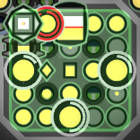

# Room Layout

----


As you can see in the above image, the clarkok bot is using a flexible room layout. In the layout procedure, the bot
will try every possible locations for the spawn cluster. And, for each attempt, 1) place down the lab cluster, 2)
calculate the roads from the spawn cluster to a few important locations, 3) generate the extensions and towers in a
dynamic manner, and 4) use a weight min-cut algorithm to place the ramparts. And from all those attempts, we choose the
one with highest room score, described in [Room Score and Auto Expansion](04-room-score-and-auto-expansion.md).

The planner is written in generators, and the execution is split into multiple ticks (often in hundreds or even
thousands of ticks). It is executed by the room score federal level state machine ahead of room claiming, except for the
first room after a respawn. As for the first room, we skip the rampart generation as it is the most time-consuming part,
to save us precious start up ticks.

## Spawn Cluster



The spawn cluster contains all 3 spawns and most of those singleton structures available in RCL8 rooms, 12 extensions,
and a container in the center act as the refill buffer. The spawn cluster is able to provide 1800 / 3300 energy at RCL7
/ RCL8. With the help with those extensions placed around the source, we should be able to spawn most of non-combat
creeps without drawing energy from other extensions.

On the diagonal surrounding locations of the center container, there sit 4 move-less creeps. The one near terminal /
factory and power spawn is the manager, and the others are fillers. The manager is responsive for balancing resources
between those singleton structures. And it will also fill the center container. While the fillers will take energy from
that container and fill spawns and extensions in the cluster.

The spawn cluster is rotated to make sure the distance between the storage and the controller is minimized at the given
center point.

## Lab Cluster


The lab cluster contains all the 10 labs, a nuker and an observer. We put the nuker in the lab cluster instead of the
spawn cluster because it only needs 3 energy/tick with some trivial `G`. This rate is much smaller than the rate of
exchanging resource between storage and terminal. The lab cluster is also rotated to make sure the top right corner in
the image has shortest path to terminal.

Also, we will ensure the two road wings in the lab cluster is not blocked by terrain walls or non-walkable structures,
with the help of the accessibility system below. So when creeps need to be boosted, they can always go into the lab
cluster from the top right entrance, and leave the cluster from either of the wings without blocking each other. 

## Roads and the Accessibility System

The path finder used in the planner is a hand-made one with A\* algorithm. It is slightly slower than the game provided
one, but it give us more flexibility. For example we can use float number as the cost, and we can use conditions to
finish the path searching instead of some destination points / ranges.

In the room planner's path finding, we prefer those points (called road points) at `(x + 52 - y) % 4 == A || (x + y) % 4
== B`, so the path can have higher probability following below pattern, where the constant `A` and `B` are chosen to
make sure the road before the storage is on one of the cross points. The reason we are doing this is, the roads
placement is done before the extension placement, so we need to leave some space in advance. 

```

rr      rr      rr
  rr  rr  rr  rr  rr
    rr      rr      
  rr  rr  rr  rr  rr
rr      rr      rr
  rr  rr  rr  rr  rr

```

We will calculate multiple paths at this stage, as listed below:

 1. path from storage to each source, and the controller
 2. path from terminal to mineral
 3. path from terminal to the lab cluster

Also, there can be some points of interests need to be accessible (aka. access points, Eg, the decoders in season #2).
And we don't want our extensions, either those near the sources or others placed dynamically, block some narrow
throttling points yielded by the terrain walls. Here the accessibility system comes in to play.

We maintain a access road map, starting from a clone of the terrain map with the roads generated by the above steps, and
the roads in both clusters. We will fill some other road points on that map, preventing future steps from placing
blocking structures on those points. Those road points placed in this access road map will not be actually built.

The First step is, for each access point, we find a path from the point to any of the exit, and fill the path as road in
the access map, to ensure those access point can be accessible from out side of the room. 

Then, we assign a unique non-zero id to each group of unwalkable points, like terrain wall group or the cluster of
structures we just placed, using multiple floodfill passes. We prepare a new map called the id map to record the group
id of each point in the room, and initially we only set the map for those unwalkable points, while other walkable points
has zero in the map.

We add all the unwalkable points in a queue and start another floodfill. For each point with zero in the id map the fill
reached, it will set the id map to the value of the previous point and add the new point back in the queue. Other wise
if the current value of the new point is different from the previous point, we set it as road in the *access* map, and
throw it. We also throw the point if the access map has already been filled as a road at that point.

In the end, we will get something like below, we will avoid putting unwalkable structures on those road points.


## Extensions and Towers

Now we got the access map, we can proceed with extensions and towers.

First we will place the extensions and links near sources. We use the last point in the path to each sources, as the
standing miner's location, and place a container there. Then we will check the surrounding location to that point, if
the location is free (not a road, not a terrain wall, and not marked as road in the access map), we put a link first,
and extensions in the rest.

To place the rest of extensions and towers, we will do a flood fill again from the road right before the storage. For
each point we fill, we will put a road if it is a *road point* and at least one of its surroundings has not been
visited. Otherwise we put an extension or a tower, based on the number of placed structures and the availability in each
RCL.

## Ramparts

After all the structures are placed, we can finally setup the ramparts. The min-cut algorithm is straight forward, we
run it and it will give us a set of points forming a cut from the base to the exits. We put ramparts on those points.
But that's not enough, as the ranged killers are sometimes strong enough to kill our defenders even before they get to
the ramparts. We need to build roads and extra protection for those defenders.

We will group the ramparts if they can access each other, and for each group, we will build a path with road to them,
and add roads under those ramparts. Then we identify the region accessible to the enemy with another floodfill from the
room exits. We build a safe map base on it, a point is consider safe only if it is under a rampart, or it is at least 3
points far from those points where enemy can stand on. Finally we add ramparts for all the roads and structures if they
are not at safe.  The safe map will be serialized and saved together with the plan result, and it will be used in room
defense when the room comes alive.

## Bunker Design

// TODO add an image of the bunker design

The clarkok bot can also use a bunker design if it gets higher score. But in most of the cases, the bot prefer dynamic
layout, mainly due to the number of ramparts, and the distance from storage to controller. Below list shows the major
advantages comparing the bunker design to its counterpart:

1. it finishes MUCH faster than the dynamic one, mainly because it doesn't need to run the min cut
2. it has more stable extension refill latency, so higher refill power
3. it has more powerful towers, as the towers can almost always work in their optimal range 

And the major disadvantages:

1. it uses more ramparts in most cases, although the ramparts are pretty close to the storage, the overall cost can be
   higher
2. it may have longer path length from storage to controller, causing higher upgrade cost
3. it has more narrow paths from outside to the bunker center, potentially causing more traffic jam 
4. it is not cool!

